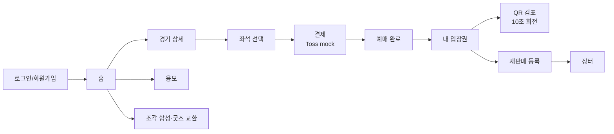

<div align="center">

# 🎨 FRONTEND — `Proje/`

**React 19 · TypeScript 5.8 · Vite 6 · Tailwind CSS 4 · React Router 7 · ethers.js 6**


</div>

> 📌 이 문서는 **`frontend` 브랜치**의 영역 문서입니다.
> 프로젝트 전체 설명은 [메인 README](../README.md)를 보세요.

---

## 실행

```bash
cd Proje
npm install
cp .env.example .env
npm run dev          # http://localhost:5173
```

| 명령 | 하는 일 |
|---|---|
| `npm run dev` | 개발 서버 (0.0.0.0:5173 — 같은 네트워크의 휴대폰에서도 접속 가능) |
| `npm run typecheck` | `tsc --noEmit` — 타입만 검사 |
| `npm run build` | 타입 검사 후 프로덕션 빌드 |
| `npm run build:oracle` | 배포용 빌드 (`VITE_API_URL`을 운영 도메인으로 고정) |
| `npm run preview` | 빌드 결과 미리보기 |

## 환경변수

| 변수 | 설명 |
|---|---|
| `VITE_API_URL` | 백엔드 API 주소. 비우면 Vite 프록시가 `/api`를 로컬 서버로 넘깁니다 |
| `VITE_CONTRACT_ADDRESS` | TicketNFT 컨트랙트 주소 (온체인 조회용) |
| `VITE_TOSS_CLIENT_KEY` | Toss Payments 클라이언트 키 (테스트 키) |
| `VITE_GOOGLE_CLIENT_ID` | 구글 로그인 클라이언트 ID |
| `VITE_DEMO_ALLOW_MOCK_SIGNATURE` | 서명 검증 우회 — **서버 값과 반드시 일치해야 함**, 기본 `false` |

## 구조

```
Proje/
├── app/
│   ├── pages/        화면 29개 — 예매·마이티켓·장터·응모·교환·검표·관리자
│   ├── components/   Layout, QRScanner, AdminOnly, LegendaryReveal, ui/
│   ├── context/      AuthContext(로그인 상태), AppSettingsContext
│   ├── hooks/        useTicketQR(회전 QR), useBookingAccess(예매 권한)
│   ├── api/          authApi · walletApi · didApi
│   ├── lib/          contract.ts(ethers 연동), authHeaders.ts
│   ├── data/         ticketing.ts — 구장·좌석 등급·가격의 프론트 원본
│   ├── types/        ethereum.d.ts (window.ethereum 타입)
│   └── routes.tsx    라우팅 정의
├── styles/           theme.css · tailwind.css · fonts.css
└── public/           굿즈·박스 이미지, 응모권 에셋
```

## 화면 흐름



## 이 영역에서 주의할 점

**가격표가 두 벌 있습니다.**
`app/data/ticketing.ts`(프론트)와 `server/config/seatPricing.js`(서버)가 같은 값을 가져야 합니다.
프론트 값만 고치면 백엔드 테스트 `seatPricing`이 **실패합니다.** 이건 버그가 아니라 안전장치입니다 —
결제 금액의 최종 기준은 언제나 서버입니다.

**QR은 컴포넌트가 아니라 훅이 만듭니다.**
`useTicketQR`이 10초 슬롯마다 서버에서 새 토큰을 받아옵니다. 화면을 캡처해도 다음 슬롯에서는
통하지 않으므로, QR을 캐싱하거나 `useMemo`로 고정하면 안 됩니다.

**지갑 없이도 화면이 떠야 합니다.**
MetaMask가 없는 환경에서 `window.ethereum` 접근이 터지지 않도록 `lib/contract.ts`가 감싸고 있습니다.
새 컨트랙트 호출을 추가할 때 같은 경로를 타야 합니다.

**로그인 토큰은 `localStorage`에 있습니다.**
httpOnly 쿠키로 옮기려면 CSRF 대응이 함께 필요해 이번 범위에서는 다루지 않았습니다.
(→ 메인 README의 "현재 한계")

## 확인 명령

```bash
npm run typecheck    # 오류 0 이어야 함
npm run build        # 프로덕션 빌드 성공해야 함
```
