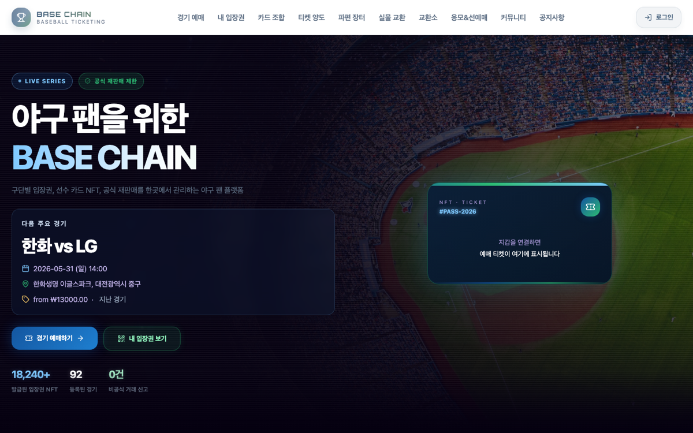
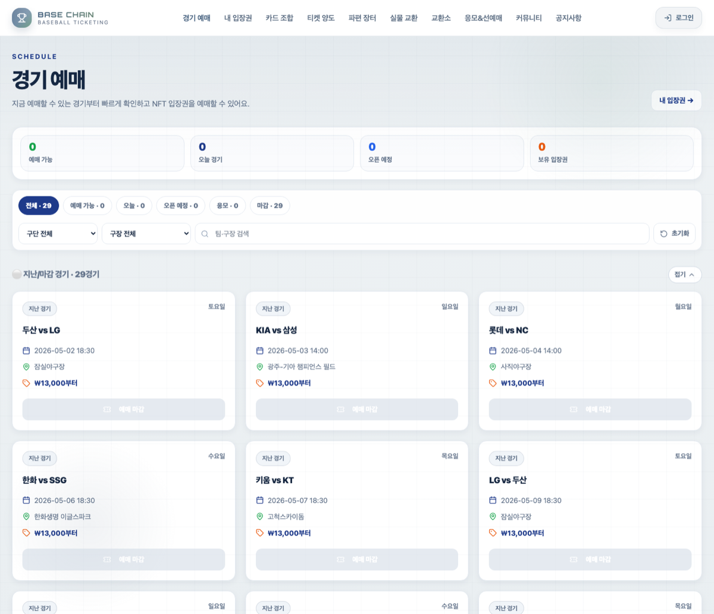
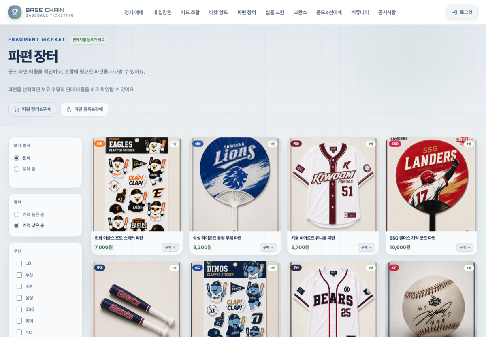
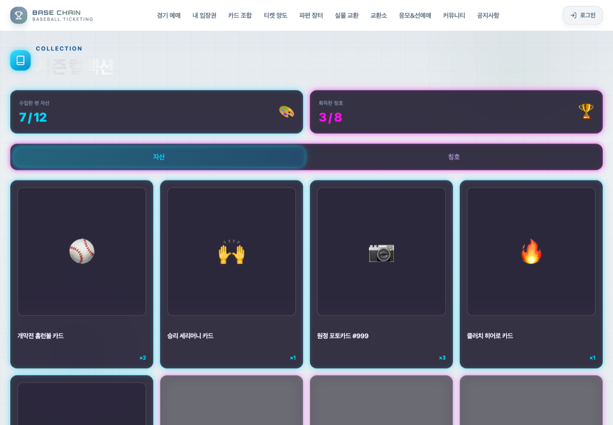
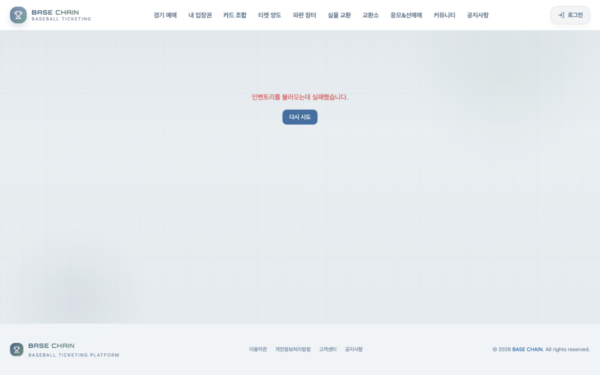
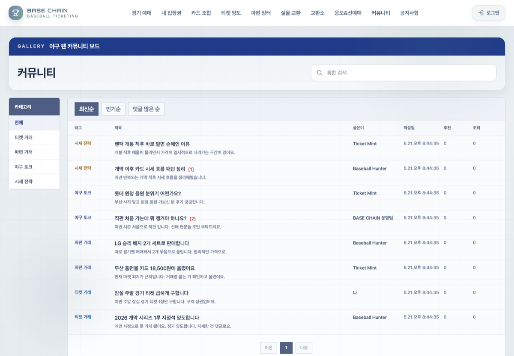
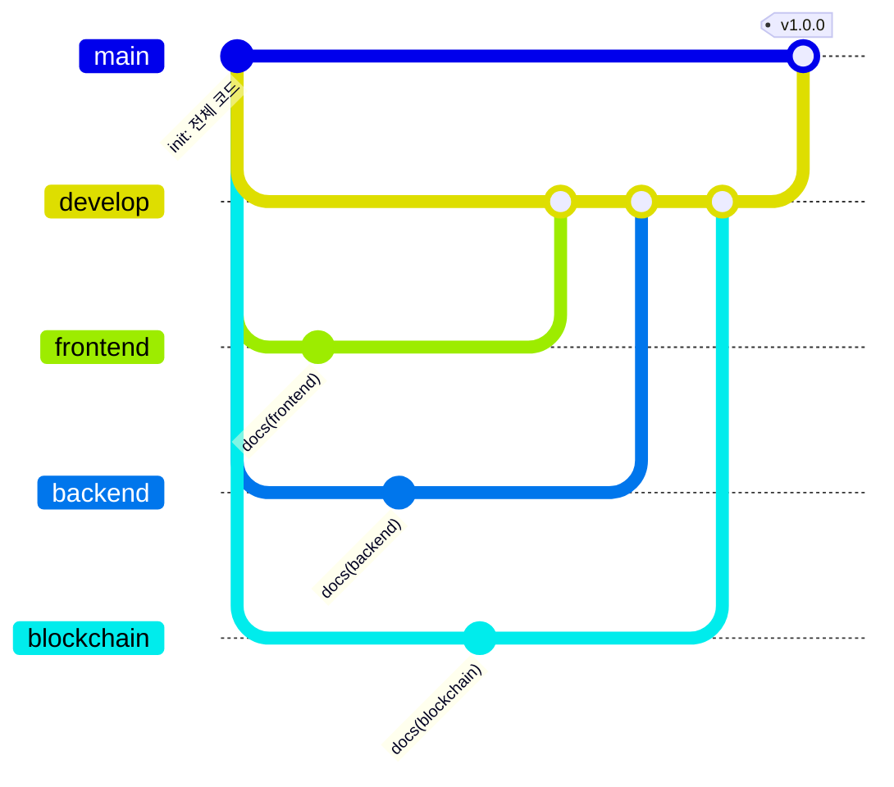
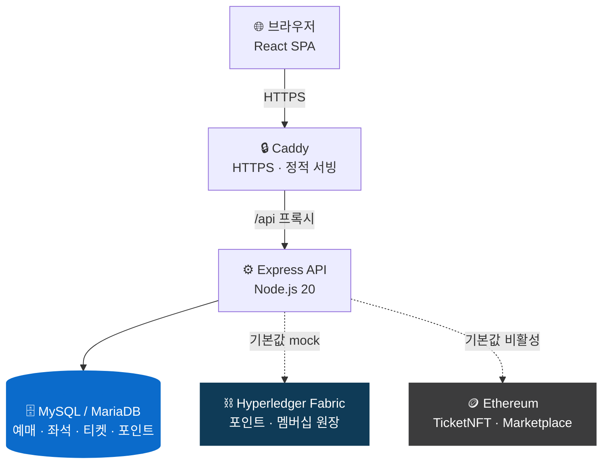
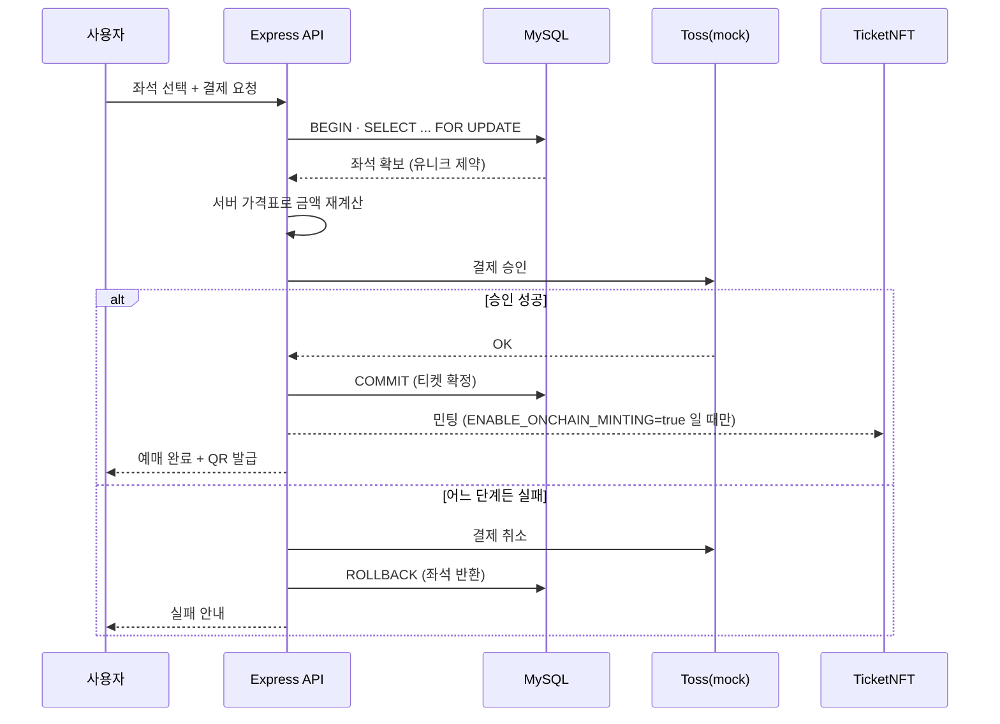

<div align="center">

# ⚾ BASE CHAIN

### 블록체인 NFT 야구 티켓팅 플랫폼

예매 → NFT 입장권 → QR 검표 → 재판매 → 포인트·응모까지<br/>
**티켓 한 장의 일생을 하나의 상태 흐름으로 묶은** 티켓팅 플랫폼입니다.

<br/>

[](https://juyoung-basechain.duckdns.org)
[](LICENSE)

[](https://github.com/FutureAria/base-chain-ticketing/actions/workflows/ci.yml)
[](https://github.com/FutureAria/base-chain-ticketing/issues?q=is%3Aissue+is%3Aopen+label%3A%22good+first+issue%22)
[](CONTRIBUTING.md)


<br/>


</div>

---

> **암표와 부정 양도를 막으려면 "이 티켓이 지금 누구 것인가"가 흔들리지 않아야 합니다.**
> 그래서 이 프로젝트는 화면 기능보다 **상태 흐름**(사용자가 보는 티켓 상태 / DB 예매 상태 /
> NFT 발급 상태 / 재판매 상태)을 먼저 맞추는 데 무게를 뒀습니다.

---

## 📑 목차

| | | |
|---|---|---|
| [🖼 화면](#-화면) | [🌿 브랜치 구성](#-브랜치-구성) | [📚 문서](#-문서) |
| [✨ 핵심 기능](#-핵심-기능) | | |
| [🏗 아키텍처](#-아키텍처) | [🚀 빠른 시작](#-빠른-시작) | [🔑 환경변수](#-환경변수) |
| [🧪 테스트](#-테스트) | [🛡 설계에서 신경 쓴 부분](#-설계에서-신경-쓴-부분) | [⚠️ 현재 한계](#️-현재-한계) |
| [📂 디렉터리 구조](#-디렉터리-구조) | [🤝 기여하기](#-기여하기) | [🤖 AI 보조도구 활용](#-ai-보조도구-활용) |
| [👥 팀](#-팀) | [📜 라이선스](#-라이선스) | |

---

## 🖼 화면

<table>
<tr>
<td width="50%"></td>
<td width="50%"></td>
</tr>
<tr>
<td align="center"><b>메인</b><br/><sub>다음 경기·발급 입장권 현황·지갑 연결 안내</sub></td>
<td align="center"><b>경기 예매</b><br/><sub>구단·구장 필터, 경기별 예매 상태와 최저가</sub></td>
</tr>
<tr>
<td></td>
<td></td>
</tr>
<tr>
<td align="center"><b>파편 장터</b><br/><sub>구단별 굿즈 조각 매물, 판매자별 등록가 비교</sub></td>
<td align="center"><b>시즌 컬렉션</b><br/><sub>수집한 팬 자산과 획득 칭호</sub></td>
</tr>
<tr>
<td></td>
<td></td>
</tr>
<tr>
<td align="center"><b>카드 조합</b><br/><sub>조각 합성으로 카드 NFT 발급</sub></td>
<td align="center"><b>커뮤니티</b><br/><sub>티켓·파편·야구·전략 게시판</sub></td>
</tr>
</table>

> 로컬 실행 화면입니다(`TOSS_MODE=mock` · `FABRIC_MODE=mock`). 동작하는 데모는 위 **Live Demo** 배지에서 확인할 수 있습니다.
> 예매 상태가 "마감"인 것은 로컬 시드 데이터의 경기 일정이 지난 날짜이기 때문입니다.

---

## 🌿 브랜치 구성

이 저장소는 영역별 작업 브랜치를 나눠 운영합니다. 각 브랜치는 **전체 코드를 그대로 갖고**,
자기 영역의 상세 문서를 추가로 담습니다. 운영 규칙은 [`docs/BRANCHES.md`](docs/BRANCHES.md)에 있습니다.

| 브랜치 | 역할 | 담긴 것 | 상세 문서 |
|---|---|---|---|
| **`main`** | 배포·제출 기준 | 전체 코드 + 이 README | — |
| **`develop`** | 통합 브랜치 | 작업 브랜치들이 합쳐지는 곳 | — |
| **`frontend`** | 화면·상태 관리 | `Proje/` React SPA (페이지 29개) | [`Proje/README.md`](../../blob/frontend/Proje/README.md) |
| **`backend`** | API·DB·결제 | `server/` Express + MySQL (라우트 17개) | [`server/README.md`](../../blob/backend/server/README.md) |
| **`blockchain`** | 컨트랙트·체인코드 | `blockchain/` Solidity, `fabric/` Go 체인코드 | [`blockchain/README.md`](../../blob/blockchain/blockchain/README.md) |



> 📌 이 저장소는 팀 저장소의 코드를 **영역별로 정리한 개인 아카이브 사본**입니다.
> 원본 협업 커밋 이력은 [`hsw0914-window/TicketBlockChain`](https://github.com/hsw0914-window/TicketBlockChain)에 있습니다.
> 원본 히스토리에는 `.env`가 포함된 커밋이 있어, 이 저장소는 **키가 섞이지 않도록 히스토리를 새로 시작**했습니다.

<details>
<summary>📖 브랜치 사용법</summary>

```bash
# 프론트만 보고 싶을 때
git clone https://github.com/FutureAria/base-chain-ticketing.git
cd base-chain-ticketing
git switch frontend && cat Proje/README.md

# 백엔드
git switch backend && cat server/README.md

# 블록체인
git switch blockchain && cat blockchain/README.md
```

</details>

---

## 📚 문서

무엇이 궁금한지에 따라 갈라집니다.

| 알고 싶은 것 | 문서 |
|---|---|
| **왜 블록체인 프로젝트인데 좌석을 DB가 확정하나** | [`docs/ARCHITECTURE.md`](docs/ARCHITECTURE.md) — 신뢰 경계, 티켓 상태 기계, 좌석 잠금 원리 |
| **어떤 API 가 있나** | [`docs/API.md`](docs/API.md) — 엔드포인트 89개, 인증 등급 |
| **어떤 테이블이 있나** | [`docs/DATABASE.md`](docs/DATABASE.md) — 테이블 40개, 상태 ENUM 10종 |
| **개발 환경이 안 뜬다** | [`docs/DEVELOPMENT.md`](docs/DEVELOPMENT.md) — 셋업과 **자주 막히는 곳 9건** |
| **왜 이 기술을 골랐나** | [`docs/TECH-DECISIONS.md`](docs/TECH-DECISIONS.md) — 결정 10건의 대안·이유·**대가** |
| **어떻게 협업했나 · AI 를 얼마나 썼나** | [`docs/COLLABORATION.md`](docs/COLLABORATION.md) — 팀 이력, 관리 체계, 부족했던 점, **AI 보조도구 활용 내역(약 80%)** |
| **브랜치·커밋 규칙** | [`docs/BRANCHES.md`](docs/BRANCHES.md) |
| **배포 절차** | [`docs/DEPLOYMENT.md`](docs/DEPLOYMENT.md) · [`docs/ORACLE_DEMO_DEPLOYMENT.md`](docs/ORACLE_DEMO_DEPLOYMENT.md) |
| **기여하고 싶다** | [`CONTRIBUTING.md`](CONTRIBUTING.md) · [`ROADMAP.md`](ROADMAP.md) · [`CODE_OF_CONDUCT.md`](CODE_OF_CONDUCT.md) |
| **보안 정책·취약점 제보** | [`SECURITY.md`](SECURITY.md) |

영역별 상세 문서는 각 폴더에 있습니다 —
[`Proje/README.md`](Proje/README.md) · [`server/README.md`](server/README.md) · [`blockchain/README.md`](blockchain/README.md)

---

## ✨ 핵심 기능

| | 기능 | 설명 |
|:---:|---|---|
| 🎟 | **경기 예매** | 구장·좌석 등급·블록 단위 좌석 선택, 권종별(일반/청소년/멤버십/키즈) 요금 |
| 💳 | **결제** | Toss Payments 연동 — **기본값은 mock 모드** |
| 🪪 | **NFT 입장권** | 예매 확정 시 ERC-721 티켓 발급, 좌석·경기 정보를 온체인 메타데이터로 보관 |
| 📱 | **QR 검표** | 10초마다 회전하는 HMAC 기반 1회용 QR, 경기 시작 N시간 전부터 활성화 |
| 🔁 | **티켓 재판매** | MetaMask 서명으로 판매자 본인 확인 후 등록, **정가 초과 방지** |
| 🏅 | **포인트·멤버십** | 입장 실적 기반 티어(베이직/브론즈/실버/골드), 티어별 혜택 지급 |
| 🎲 | **우선 예매 응모** | 응모권 NFT로 추첨, 당첨자에게 지정 좌석 우선 예매권 부여 |
| 🧩 | **조각·카드 교환** | NFT 조각 합성(ERC-1155), 실물 굿즈 교환 신청 |

---

## 🏗 아키텍처



> **좌석 점유의 단일 기준은 MySQL입니다.**
> 블록체인은 발급 증명과 이력 기록을 담당하고, "이 좌석이 팔렸는가"는 DB 제약으로 확정합니다.
> 온체인 확인을 기다리는 동안 좌석이 떠 있으면 이중 예매가 생기기 때문입니다.

### 예매 한 건이 흐르는 순서



---

## 🚀 빠른 시작

**요구사항** — Node.js 20+ · MySQL 8 또는 MariaDB 10.6+

```bash
git clone https://github.com/FutureAria/base-chain-ticketing.git
cd base-chain-ticketing
```

<table>
<tr><th width="33%">1️⃣ 백엔드</th><th width="33%">2️⃣ 프론트엔드</th><th width="33%">3️⃣ 컨트랙트 (선택)</th></tr>
<tr valign="top">
<td>

```bash
cd server
npm install
cp .env.example .env
# 값을 채운 뒤
npm start
```

→ `http://localhost:4000`

첫 실행 시 DB·테이블·시드 데이터가 자동 생성됩니다.

</td>
<td>

```bash
cd Proje
npm install
cp .env.example .env
npm run dev
```

→ `http://localhost:5173`

</td>
<td>

```bash
cd blockchain
npm install
npm test
npm run compile
```

DB 없이 단독 실행됩니다.

</td>
</tr>
</table>

---

## 🔑 환경변수

`server/.env` — 전체 목록은 [`server/.env.example`](server/.env.example) 참고

| 변수 | 필수 | 설명 |
|---|:---:|---|
| `DB_HOST` `DB_PORT` `DB_USER` `DB_PASSWORD` | ✔ | 데이터베이스 접속 정보 |
| `JWT_SECRET` | ✔ | 로그인 토큰 서명 키. **없으면 서버가 시작되지 않습니다** |
| `QR_SECRET` | ✔ | QR 토큰 HMAC 키. **없으면 서버가 시작되지 않습니다** |
| `RESET_DB_ON_START` | | `true`면 시작 시 DB를 초기화합니다. **운영에서는 반드시 `false`** |
| `TOSS_MODE` | | `mock`(기본) / `real` |
| `FABRIC_MODE` | | `mock`(기본) / `real` |
| `ENABLE_ONCHAIN_MINTING` | | `true`일 때만 실제 온체인 민팅을 시도합니다 (기본 비활성) |
| `DEMO_ADMIN_PASSWORD` `ROOT_ADMIN_PASSWORD` | | 관리자 비밀번호. **설정하지 않으면 관리자 계정을 만들지 않습니다** |
| `FRONTEND_ORIGINS` | | CORS 허용 출처(쉼표 구분) |
| `RATE_LIMIT_AUTH_MAX` | | 인증 API 요청 한도 (기본 10분당 20회) |

> ⚠️ **`.env`는 절대 커밋하지 마세요.** `.gitignore`에 등록되어 있습니다.
> 제출용 ZIP은 반드시 [`scripts/make-submission.sh`](scripts/make-submission.sh)로 만드세요 — `.env`가 들어가면 ZIP을 삭제하고 중단합니다.

---

## 🧪 테스트

```bash
cd server     && npm test        # 백엔드 83개
cd blockchain && npm test        # 컨트랙트 18개
cd Proje      && npm run typecheck
```

<table>
<tr valign="top">
<td width="50%">

**백엔드 83개** — 모듈 로드 38 + 기능 45

| 파일 | 개수 | 확인하는 것 |
|---|---:|---|
| `moduleLoad` | 38 | 모든 서버 모듈이 실제로 로드되는지 |
| `onchainPayment` | 13 | 온체인 결제의 수신자·금액·확정·재사용 검증 |
| `seatPricing` | 10 | 좌석 가격 조작 차단, 프론트·서버 가격표 일치 |
| `seatConcurrency` | 5 | 좌석 동시 예매, 부분 실패 롤백 |
| `inactiveAccount` | 5 | 비활성 계정이 로그인·인증을 통과하지 못하는지 |
| `tossMockGuard` | 5 | 실결제 모드에서 mock 우회가 막히는지 |
| `raffleFairness` | 4 | 추첨 셔플의 분포 균등성 |
| `combineConcurrency` | 3 | 조각 합성 시 카드 복제 차단 |

</td>
<td width="50%">

**컨트랙트 18개** — `TicketNFT.test.ts`

- 배포 · 민팅 권한 (4)
- 티켓 발급 · 이벤트 · tokenId 증가 (4)
- 좌석 중복 방지 (4)
- 입장 처리 · 재입장 방지 (4)
- 양도 · 무단 이전 차단 (2)

<br/>

**동시성 테스트**는 실제 DB에 병렬 요청을 밀어넣어
**같은 좌석에 10명이 동시에 몰려도 한 장만 발권되는지**
확인합니다.
DB에 연결할 수 없으면 실패가 아니라 **건너뜁니다**
(DB 없는 CI 환경: 75 pass / 8 skip / 0 fail).

</td>
</tr>
</table>

---

## 🛡 설계에서 신경 쓴 부분

<details open>
<summary><b>좌석 이중 예매 방지 — 2중 방어</b></summary>

애플리케이션에서 `SELECT ... FOR UPDATE`로 동시 요청을 직렬화하고, 그것이 뚫려도
DB의 유니크 제약(`uq_ticket_active_seat`)이 INSERT를 거부합니다.
검사와 INSERT 사이의 틈은 코드만으로는 없앨 수 없기 때문에 **마지막 판단은 DB에 맡겼습니다.**
환불·취소된 티켓은 좌석 잠금 키가 `NULL`이 되어 자동으로 다시 판매됩니다.

→ [`server/services/ticketService.js`](server/services/ticketService.js)
</details>

<details>
<summary><b>결제 금액은 서버가 계산</b></summary>

클라이언트가 보낸 좌석 가격은 검증용으로만 쓰고, 실제 승인 금액은 서버 가격표에서
다시 계산합니다. 프론트와 서버 가격표가 어긋나면 테스트가 실패합니다.

→ [`server/config/seatPricing.js`](server/config/seatPricing.js)
</details>

<details>
<summary><b>좌석 확보 → 결제 순서</b></summary>

결제를 먼저 하면 "돈은 빠져나갔는데 좌석은 남이 가져간" 상태가 생깁니다.
좌석을 트랜잭션으로 확보한 뒤 결제를 승인하고, 이후 어느 단계에서 실패하든
**결제 취소와 좌석 반환을 함께** 수행합니다.
</details>

<details>
<summary><b>QR 위조 방지</b></summary>

QR은 `HMAC-SHA256(ticketId:슬롯)`이며 기본 10초마다 값이 바뀝니다.
캡처한 QR을 돌려써도 다음 슬롯에서는 통하지 않습니다.
</details>

<details>
<summary><b>그 외 보안 보완 (2026-08)</b></summary>

| 고친 것 | 어떻게 |
|---|---|
| 비밀번호 찾기 계정탈취 | 평문 임시비번 반환 제거 → 1회용 토큰 재설정, 계정 열거 차단 |
| 하드코딩 관리자 계정 | `admin1234`/`root1234` 제거, 환경변수 없으면 계정 미생성 |
| 프로세스 크래시 | 전역 에러 핸들러 + async 라우트 래핑 |
| 무차별 대입 | 레이트 리밋(인증 10분 20회), CORS 와일드카드 기본 차단 |
| 응모권 IDOR·당첨자 정보 노출 | 소유자 검증 추가, 응답에서 개인정보 제거 |
| 체인코드 접근제어 | 조각 복제·미검증 온체인 결제 차단 |
</details>

---

## ⚠️ 현재 한계

정직하게 적어 둡니다.

- **Hyperledger Fabric은 기본값이 mock입니다.** 인메모리 구현이라 서버를 재시작하면
  Fabric 측 기록(티켓 등록·예약·응모)은 사라집니다.
  포인트와 멤버십은 DB의 `point_events`에서 다시 계산되어 복구됩니다.
- **온체인 민팅은 기본 비활성**입니다(`ENABLE_ONCHAIN_MINTING=false`).
  컨트랙트는 작성·테스트되어 있으나 상시 연동은 가스비 문제로 켜 두지 않았습니다.
- **Toss Payments는 mock 모드**가 기본이며 **실제 결제는 발생하지 않습니다.**
- 비밀번호 재설정은 토큰 발급까지 구현되어 있고 **메일 발송 연동이 남아 있습니다**.
- 부하 테스트와 전문 보안 감사는 수행하지 않았습니다.
- 로그인 토큰을 `localStorage`에 보관합니다. httpOnly 쿠키로 옮기려면 CSRF 대응이 함께
  필요해 이번 범위에서는 다루지 않았고, 대신 저장형 XSS 경로(업로드 확장자)를 막았습니다.

<details>
<summary><b>시연용 서명 우회 플래그 (중요)</b></summary>

`VITE_DEMO_ALLOW_MOCK_SIGNATURE`(프론트)와 `DEMO_ALLOW_MOCK_SIGNATURE`(서버)는
MetaMask 없이도 재판매 등록이 되도록 서명 검증을 건너뛰는 스위치입니다.

**두 값은 반드시 같아야 합니다** — 한쪽만 켜면 프론트는 가짜 서명을 만들고 서버는 거부해서
"서명을 검증할 수 없습니다" 오류만 남습니다.

기본값은 양쪽 모두 `false`입니다. 켜면 "지갑 서명으로 판매자 본인을 확인한다"는 보증이
사라지므로, 검증 과정을 보여줘야 하는 자리에서는 끄고 MetaMask로 시연하는 것을 권합니다.
</details>

---

## 📂 디렉터리 구조

```
base-chain-ticketing/
├── 📁 Proje/            프론트엔드 — React 19 + Vite + TypeScript
│   ├── app/pages/           화면 29개 (예매·마이티켓·장터·응모·교환·검표)
│   ├── app/data/            구장·좌석 등급 정의 (가격의 프론트 원본)
│   ├── app/lib/             지갑·컨트랙트 연동 (ethers.js)
│   └── app/context/         인증·지갑 전역 상태
├── 📁 server/           백엔드 API — Express + MySQL
│   ├── routes/              API 라우트 17개 · 엔드포인트 89개
│   ├── services/            비즈니스 로직 (티켓·포인트·멤버십·결제·NFT 브리지)
│   ├── config/              좌석 가격표 등 서버 기준값
│   ├── db/                  스키마·마이그레이션·시드
│   ├── mock/                Fabric / NFT 브리지 mock 구현
│   └── tests/               백엔드 테스트 83개
├── 📁 blockchain/       스마트 컨트랙트 — Hardhat + Solidity 0.8.28
│   ├── contracts/           TicketNFT · TicketMarketplace · BoxNFT · FragmentNFT
│   └── test/                컨트랙트 테스트 18개
├── 📁 fabric/           Hyperledger Fabric 네트워크 · 체인코드(Go)
├── 📁 deploy/           Oracle Cloud 배포 설정 예시
├── 📁 docs/             배포 가이드
└── 📁 scripts/          제출용 ZIP 생성 (.env 유출 차단)
```

---

## 🤝 기여하기

기여를 환영합니다. 저장소만 보고 첫 PR 까지 갈 수 있게 절차를 정리해 두었습니다.

**처음이시라면** → [`good first issue`](https://github.com/FutureAria/base-chain-ticketing/issues?q=is%3Aissue+is%3Aopen+label%3A%22good+first+issue%22)

이 라벨이 붙은 이슈는 세 가지를 보장합니다.

- 고칠 **파일과 함수**가 적혀 있습니다
- 다른 영역(블록체인·DB)을 몰라도 그 부분만 보고 고칠 수 있습니다
- **확인 명령**이 이슈에 적혀 있습니다

**환경 준비는 가볍습니다.** 고칠 곳만 띄우면 되고, Docker·Fabric 네트워크·테스트넷 지갑은
필요 없습니다. 기본값이 mock 이라 **Node 20 + MySQL** 만 있으면 전 기능이 돕니다.
컨트랙트 작업은 DB조차 필요 없습니다.

```bash
git clone https://github.com/FutureAria/base-chain-ticketing.git
cd base-chain-ticketing/blockchain && npm install && npm test   # 18 passing
```

| | |
|---|---|
| 절차·커밋 규칙·리뷰 기준 | [`CONTRIBUTING.md`](CONTRIBUTING.md) |
| 계획된 작업과 **하지 않기로 한 것** | [`ROADMAP.md`](ROADMAP.md) |
| 개발 환경에서 막혔을 때 | [`docs/DEVELOPMENT.md`](docs/DEVELOPMENT.md) |
| 행동 강령 | [`CODE_OF_CONDUCT.md`](CODE_OF_CONDUCT.md) |

모든 PR 은 CI 4개 잡(백엔드 린트·테스트 / 프론트 린트·타입·빌드 / 컨트랙트 / **시크릿 유출 검사**)을
통과해야 합니다.

---

## 🤖 AI 보조도구 활용

이 프로젝트는 **AI 보조도구를 폭넓게 사용해 개발했습니다** — 전체 코드의 약 80% 수준.
프롬프트로 명세를 쓰고 AI 가 구현한 뒤 사람이 검증·통합하는 방식으로 진행했습니다.

**사람이 결정하고 책임진 것** — 문제 정의와 기획, 아키텍처 판단
(좌석 확정을 블록체인이 아니라 **MySQL 유니크 제약에 맡긴 결정**,
포인트를 이벤트로만 관리하는 설계, 실결제·온체인 기본 비활성),
흩어진 5개 브랜치의 통합, 테스트 실행과 결과 판정, Oracle 배포·운영, 보안 결함 판정.

누가 썼든 **동작과 안전성은 기계로 확인합니다** — CI 4개 잡(린트 · 백엔드 83개 ·
컨트랙트 18개 · 타입 검사 · 시크릿 유출 검사)을 통과해야 머지됩니다.

상세 내역과 측정값은 [`docs/COLLABORATION.md`](docs/COLLABORATION.md#3-ai-보조도구-활용-내역).

---

## 👥 팀

| 이름 | 담당 |
|---|---|
| **한승우** | 메인 페이지, 커뮤니티, 프로젝트 총괄 |
| **박주영** | 예매·결제 흐름, 백엔드 API 통합, Oracle 배포·운영, 보안·안정성 보완 |
| **김상윤** | 블록체인 |

**개발 기간** 2026.03 ~ 2026.05 (이후 보안·안정성 보완 2026.08)

---

## 📜 라이선스

[MIT](LICENSE)

<div align="center">
<br/>

**[🔗 라이브 데모 보러 가기](https://juyoung-basechain.duckdns.org)**

</div>
