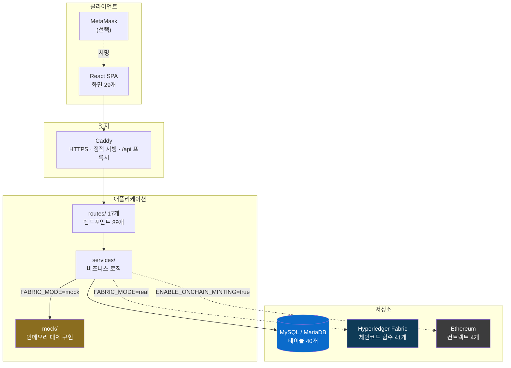
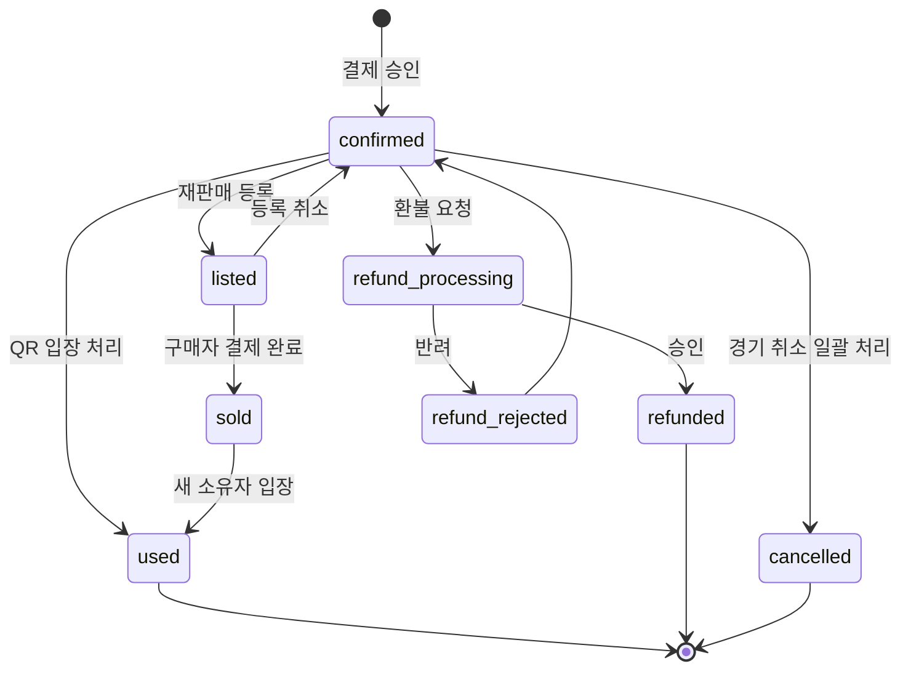
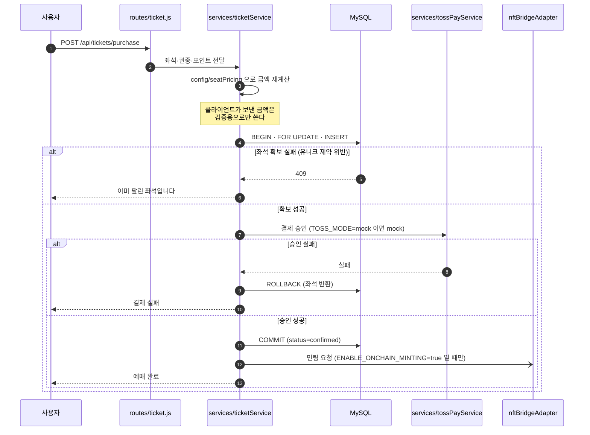
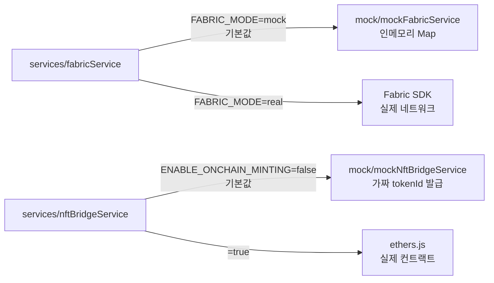
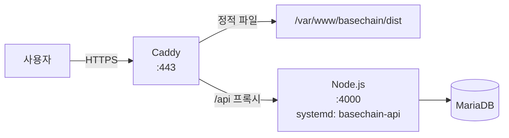

# 아키텍처

이 문서는 **왜 이렇게 나눴는지**를 설명합니다. 어떤 API가 있는지는 [API.md](API.md),
어떤 테이블이 있는지는 [DATABASE.md](DATABASE.md)를 보세요.

## 목차

1. [한 장 요약](#1-한-장-요약)
2. [신뢰의 경계 — 무엇이 무엇을 확정하는가](#2-신뢰의-경계--무엇이-무엇을-확정하는가)
3. [티켓 상태 기계](#3-티켓-상태-기계)
4. [좌석 점유 — 이 프로젝트의 핵심](#4-좌석-점유--이-프로젝트의-핵심)
5. [예매 한 건이 흐르는 순서](#5-예매-한-건이-흐르는-순서)
6. [서버 모듈 구조](#6-서버-모듈-구조)
7. [mock 어댑터 — 체인 없이 도는 이유](#7-mock-어댑터--체인-없이-도는-이유)
8. [QR 회전 메커니즘](#8-qr-회전-메커니즘)
9. [프론트엔드 구조](#9-프론트엔드-구조)
10. [배포 구조](#10-배포-구조)

---

## 1. 한 장 요약



점선은 **기본값에서 꺼져 있는 경로**입니다.

## 2. 신뢰의 경계 — 무엇이 무엇을 확정하는가

이 프로젝트에서 가장 중요한 결정입니다.

| 질문 | 답을 확정하는 곳 | 왜 |
|---|---|---|
| **이 좌석이 팔렸는가** | **MySQL** | 온체인 확인을 기다리는 동안 좌석이 떠 있으면 이중 예매가 생긴다 |
| 이 티켓이 진짜 발급된 것인가 | Ethereum (TicketNFT) | 위조 불가능한 발급 증명이 필요하다 |
| 이 사람의 포인트·등급은 얼마인가 | Fabric 원장 (+ MySQL `point_events` 로 복구 가능) | 적립·차감 이력이 임의로 고쳐지지 않아야 한다 |
| 이 QR이 지금 유효한가 | 서버 (HMAC) | 체인 왕복을 기다리면 검표가 느려진다 |
| 이 재판매자가 진짜 소유자인가 | 지갑 서명 (MetaMask) | 서버가 대신 증명할 수 없다 |

**블록체인이 "좌석 재고"를 맡지 않습니다.** 체인은 느리고, 되돌리기 어렵고,
"지금 이 순간 매진인가"를 묻기에 부적합합니다. 체인은 **일어난 일의 증명**을 맡고,
**일어나도 되는지의 판단**은 DB가 합니다.

## 3. 티켓 상태 기계

`tickets.status` 는 8개 값을 가집니다 (`ENUM`).



**좌석이 풀리는 상태는 `refunded` 와 `cancelled` 둘뿐입니다.** 나머지 상태에서는
좌석이 계속 잠겨 있습니다. 이 규칙은 코드가 아니라 **DB 컬럼 정의**에 들어 있습니다 (아래 참조).

## 4. 좌석 점유 — 이 프로젝트의 핵심

좌석 이중 예매를 막는 방법은 **두 겹**입니다.

### 1겹: 애플리케이션 트랜잭션

```sql
BEGIN;
SELECT ... FROM tickets WHERE game_id=? AND block=? AND row_num=? AND seat_number=?
FOR UPDATE;          -- 같은 좌석을 노리는 다른 요청을 여기서 줄 세운다
-- 비어 있으면 INSERT
COMMIT;
```

### 2겹: DB 생성 컬럼 + 유니크 제약 (진짜 방어선)

`tickets` 테이블에 **MySQL GENERATED STORED 컬럼**이 있습니다.

```sql
seat_lock VARCHAR(180) GENERATED ALWAYS AS (
  CASE
    WHEN status IN ('refunded','cancelled') THEN NULL
    WHEN block IS NULL OR row_num IS NULL OR seat_number IS NULL THEN NULL
    ELSE CONCAT(game_id, '|', block, '|', row_num, '|', seat_number)
  END
) STORED,
UNIQUE KEY uq_ticket_active_seat (seat_lock)
```

**동작 원리** — UNIQUE 인덱스는 `NULL` 을 중복으로 보지 않습니다.
그래서 환불·취소된 티켓은 `seat_lock` 이 자동으로 `NULL` 이 되어 **좌석이 저절로 풀리고**,
살아 있는 티켓은 "1좌석 1장"이 DB 수준에서 강제됩니다.

**왜 이렇게까지 하는가** — 검사(`SELECT`)와 삽입(`INSERT`) 사이의 틈은
애플리케이션 코드만으로는 없앨 수 없습니다. 트랜잭션 격리 수준을 올려도,
락을 걸어도, 코드 경로가 하나 늘어나면 다시 뚫립니다.
**마지막 판단을 DB에 맡기면 코드가 몇 갈래로 늘어나든 규칙이 유지됩니다.**

또 하나의 이득 — "환불하면 좌석을 반환한다"는 로직을 **어디에도 쓸 필요가 없습니다.**
상태만 바꾸면 좌석 반환이 컬럼 정의로부터 따라옵니다. 반환을 빠뜨릴 코드 경로 자체가 없습니다.

> 기존 DB에 중복 좌석이 이미 들어 있으면 이 제약을 거는 `ALTER` 가 실패합니다.
> `db/init.js` 는 제약을 걸기 전에 중복을 먼저 조회해서, **서버를 죽이지 않고**
> 무엇을 손봐야 하는지 로그로 남깁니다.

## 5. 예매 한 건이 흐르는 순서



**순서가 중요합니다.** 결제를 먼저 하면 "돈은 빠져나갔는데 좌석은 남이 가져간" 상태가 생깁니다.
좌석을 먼저 잡고 결제하며, 이후 어느 단계에서 실패하든 **결제 취소와 좌석 반환을 함께** 수행합니다.

민팅은 마지막에 **비동기로** 갑니다(`-)` 화살표). 체인이 느리거나 실패해도 예매는 확정된 상태입니다.

## 6. 서버 모듈 구조

```
요청 ─→ index.js ─→ 레이트 리밋 ─→ routes/ ─→ services/ ─→ db / mock / chain
                                      │            │
                                middleware/auth   config/seatPricing
                                                  utils/gameTime
```

| 레이어 | 책임 | 하면 안 되는 것 |
|---|---|---|
| `routes/` | 요청 파싱, 권한 확인, 응답 형식 | 비즈니스 규칙을 여기 두지 않는다 |
| `services/` | 상태 전이, 금액 계산, 트랜잭션 경계 | HTTP 를 알지 않는다 (`req`/`res` 를 받지 않는다) |
| `mock/` | 체인 없는 환경의 대체 구현 | 실제 구현과 **같은 인터페이스**를 지킨다 |
| `config/` | 서버가 기준으로 삼는 값 (좌석 가격표 등) | 클라이언트 값으로 덮어쓰지 않는다 |
| `db/` | 스키마 생성·마이그레이션·시드 | 비즈니스 규칙을 두지 않는다 (제약은 예외) |

**주요 서비스**

| 파일 | 맡는 것 |
|---|---|
| `ticketService.js` | 좌석 확보·결제 연동·환불. 트랜잭션 경계가 여기 있다 |
| `tossPayService.js` | 결제 승인·취소. `TOSS_MODE` 게이트 |
| `membershipService.js` | 입장 실적 → 티어 계산, 티어 혜택 지급 |
| `fabricService.js` / `fabricBridge.js` | Fabric 연동. `FABRIC_MODE` 로 mock/real 선택 |
| `nftBridgeService.js` / `nftBridgeAdapter.js` | 온체인 민팅 브리지. `ENABLE_ONCHAIN_MINTING` 게이트 |
| `onchainPaymentService.js` | 온체인 결제의 수신자·금액·확정·재사용 검증 |
| `schemaGuardService.js` | 코드가 기대하는 스키마와 실제 DB가 어긋났는지 감지 |
| `presentationDemoService.js` | 시연용 데이터 지급 (기본 비활성) |

## 7. mock 어댑터 — 체인 없이 도는 이유

`services/fabricService.js` 와 `services/nftBridgeService.js` 는 **어댑터**입니다.
환경변수를 보고 실제 구현과 mock 구현 중 하나를 고릅니다.



**얻는 것** — 기여자가 Fabric 네트워크(도커 여러 개)나 테스트넷 지갑 없이
전 기능을 돌려볼 수 있습니다. 진입 장벽이 "Node + MySQL"로 내려갑니다.

**대가** — mock 은 인메모리라 **서버를 재시작하면 Fabric 측 기록이 사라집니다**
(티켓 등록·예약·응모). 포인트와 멤버십만 MySQL `point_events` 에서 다시 계산되어 복구됩니다.
→ 영속화는 [ROADMAP](../ROADMAP.md) v1.1 항목.

**규칙** — mock 과 real 은 **같은 인터페이스**를 지켜야 합니다.
한쪽에만 함수를 추가하면 모드를 바꾸는 순간 터집니다. 테스트 `moduleLoad`(38개)가
모든 서버 모듈의 로드를 검사하는 이유이기도 합니다.

## 8. QR 회전 메커니즘

```
슬롯 = floor(현재시각 / QR_SLOT_SECONDS)      # 기본 10초
토큰 = HMAC-SHA256(QR_SECRET, "ticketId:슬롯")
```

- 검표 시 서버가 **현재 슬롯**과 **직전 슬롯**을 계산해 대조합니다 (경계에서 실패하지 않게)
- 캡처·스크린샷한 QR 은 다음 슬롯에서 통하지 않습니다
- 입장 처리는 1회만 성공하며, 성공하면 `tickets.status = used` 로 바뀝니다
- 경기 시작 N시간 전부터 활성화됩니다 (`utils/gameTime.js`)

`QR_SECRET` 이 비어 있으면 **서버가 시작되지 않습니다.** 빈 값으로 HMAC 을 만들면
누구나 토큰을 위조할 수 있기 때문입니다.

## 9. 프론트엔드 구조

```
Proje/app/
├── routes.tsx       라우팅 정의
├── pages/           화면 29개
├── components/      Layout · QRScanner · AdminOnly · LegendaryReveal · ui/
├── context/         AuthContext(로그인) · AppSettingsContext
├── hooks/           useTicketQR(회전 QR) · useBookingAccess(예매 권한)
├── api/             authApi · walletApi · didApi
├── lib/             contract.ts(ethers) · authHeaders.ts
└── data/            ticketing.ts — 구장·좌석 등급·가격의 프론트 원본
```

**가격표가 두 벌 있습니다.** `app/data/ticketing.ts`(프론트)와
`server/config/seatPricing.js`(서버)가 같은 값을 가져야 합니다.
프론트만 고치면 백엔드 테스트 `seatPricing`(10개)이 **실패합니다.**
이건 버그가 아니라 안전장치입니다 — 결제 금액의 최종 기준은 언제나 서버입니다.

**지갑 없이도 화면이 떠야 합니다.** MetaMask 가 없는 환경에서 `window.ethereum` 접근이
터지지 않도록 `lib/contract.ts` 가 감싸고 있습니다. 새 컨트랙트 호출도 같은 경로를 타야 합니다.

## 10. 배포 구조



- 프론트는 빌드 결과를 Caddy 가 **직접 서빙**합니다 (Node 를 거치지 않음)
- `/api` 만 Node 로 프록시합니다
- HTTPS 인증서는 Caddy 가 자동 발급·갱신합니다
- 상세 절차 → [DEPLOYMENT.md](DEPLOYMENT.md)

> ⚠️ 배포 시 `RESET_DB_ON_START=false` 를 반드시 유지해야 합니다.
> `true` 면 서버가 재시작될 때마다 사용자 데이터가 지워집니다.
