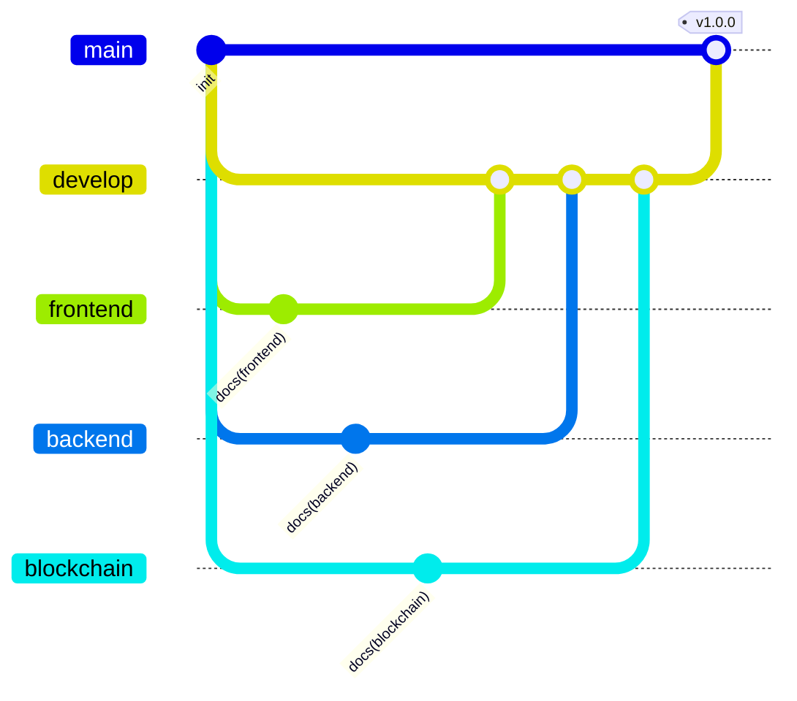

# 브랜치 운영 규칙

## 브랜치 지도

| 브랜치 | 역할 | 여기서 직접 커밋 | 머지 방향 |
|---|---|:---:|---|
| `main` | 배포·제출 기준. 항상 동작하는 상태 | ❌ | `develop` → `main` (릴리스) |
| `develop` | 통합 브랜치. 작업 브랜치가 합쳐지는 곳 | ❌ | 작업 브랜치 → `develop` |
| `frontend` | 화면·상태 관리 (`Proje/`) | ✅ | → `develop` |
| `backend` | API·DB·결제 (`server/`) | ✅ | → `develop` |
| `blockchain` | 컨트랙트·체인코드 (`blockchain/`, `fabric/`) | ✅ | → `develop` |

각 작업 브랜치는 **전체 코드를 그대로 갖고** 있습니다. 자기 영역만 잘라낸 것이 아니라,
합칠 때 충돌 없이 통째로 돌려볼 수 있게 하기 위해서입니다.
브랜치별 상세 문서는 해당 브랜치의 `Proje/README.md` · `server/README.md` · `blockchain/README.md` 에 있습니다.

## 흐름



## 작업 순서

```bash
# 1. 자기 영역 브랜치에서 시작
git switch backend
git pull

# 2. 작업 후 확인 명령을 실제로 돌린다
cd server && npm test

# 3. 커밋 — 무엇을 고쳤는지 한 줄로
git commit -m "fix: 좌석 환불 시 잠금 키가 남아 재판매가 막히던 문제 수정"

# 4. develop 으로 PR
git push origin backend
gh pr create --base develop --head backend
```

## 커밋 메시지

`<타입>: <무엇을 고쳤는지>` — 한국어로, 결과가 아니라 **바뀐 사실**을 쓴다.

| 타입 | 쓰는 때 |
|---|---|
| `feat` | 새 기능 |
| `fix` | 버그 수정 |
| `docs` | 문서만 |
| `refactor` | 동작 변화 없는 구조 변경 |
| `test` | 테스트 추가·수정 |
| `chore` | 빌드·설정 |

❌ `fix: 개선` · `update` · `수정함`
✅ `fix: 비활성화된 계정이 로그인·인증을 통과하던 문제 수정`

## 머지 전 필수 확인

| 고친 영역 | 돌려야 하는 명령 | 통과 기준 |
|---|---|---|
| `Proje/` | `npm run typecheck` · `npm run build` | 오류 0 |
| `server/` | `npm test` | 0 fail |
| `blockchain/` | `npm run compile` · `npm test` | 18 passing |

CI(`.github/workflows/ci.yml`)가 위 세 가지 + **시크릿 유출 검사**를 자동으로 돌립니다.

## 절대 커밋하면 안 되는 것

- `.env` (모든 위치) — `.gitignore`에 등록되어 있고 CI가 다시 검사합니다
- `MINTER_PRIVATE_KEY` · `JWT_SECRET` · `QR_SECRET` · DB 비밀번호
- `node_modules/` · `dist/` · `artifacts/` · `cache/` · `typechain-types/`
- Fabric이 생성한 인증서 (`fabric/basic-network/organizations/*Organizations/`)

제출용 ZIP은 반드시 `scripts/make-submission.sh` 로 만드세요 — `.env`가 들어가면 ZIP을 삭제하고 중단합니다.
